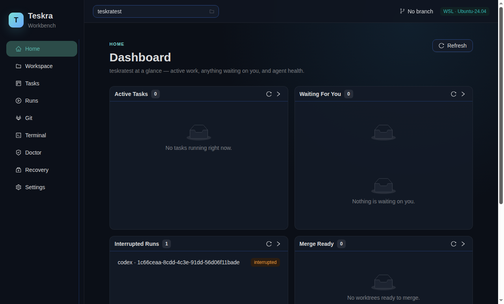
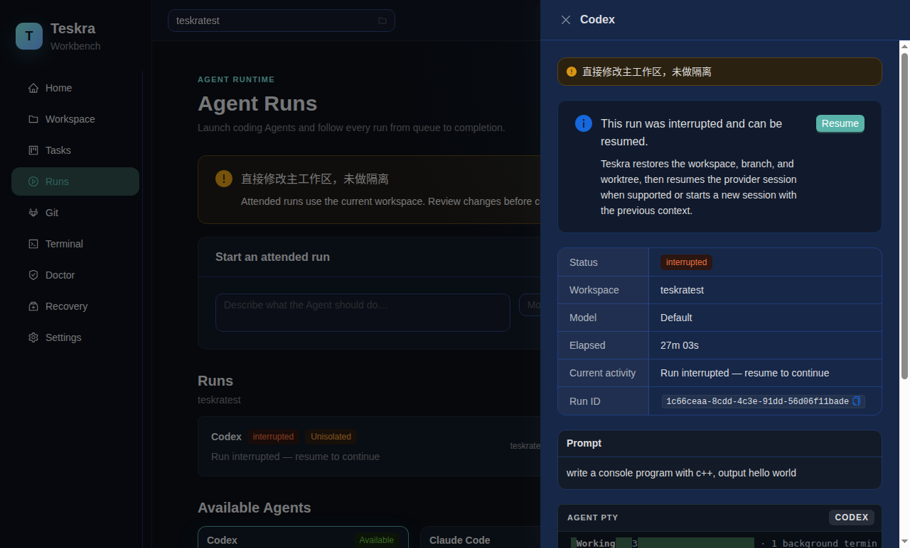
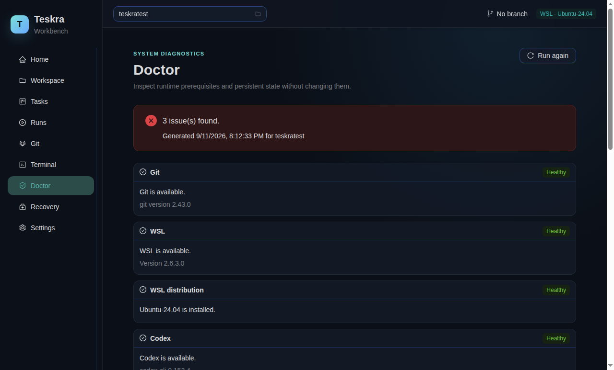

# Teskra

**Orchestrate your coding agents.**

Teskra 是一个 **Windows-first、Task-first、Agent-first** 的桌面端多 Agent 编码工作台（Electron 应用），在同一个 GUI 内统一调度 Codex CLI、Claude Code 等 Coding Agent，并提供 Workspace、PTY Terminal、Git Worktree 隔离、Review、Crash Recovery 与 Workflow 编排能力。



## 功能特性

- **多 Agent 调度**：Agent Registry + 可插拔 Adapter（Codex / Claude Code 内置），统一启动、输入、取消、恢复；并发限制与 FIFO 队列
- **Git Worktree 隔离**：每个 Run 独立 worktree（`agent/<taskId>/<agentId>/<runId>` 分支命名），Merge Preflight 八项检查，冲突现场完整保留，Reviewer 三档隔离（shared-readonly / worktree-readonly / disposable-snapshot）
- **Task → Workflow 编排**：验收标准（Acceptance Criteria）多版本管理；默认全流程 Implement → Test → Review → Criteria Gate，Iterate 双安全帽（每版本 3 轮 / 总计 8 轮）防止无限循环
- **Review 体系**：多 Reviewer 并行编排（互相不可见对方结果）、按严重级聚合（1 个 critical 即阻断，非多数投票）、逐条 Criterion 三态评审（pass / fail / unknown）
- **权限与审计**：ADR-0002 三层机制——策略下发（翻译成各 Agent CLI 自己的审批机制）+ 环境隔离 + 事后审计（命令风险五级分类，不伪造"执行前拦截"）
- **Crash Recovery**：状态对账（Reconciliation）、中断 Run 恢复（原生会话恢复 / 上下文注入新会话）、Retention GC（dry-run / 可取消 / 可审计）、Recovery Center 统一入口
- **安全**：`contextIsolation` / `sandbox` / `nodeIntegration: false` 安全基线（CI 断言）；Credential Store（safeStorage）保存敏感 env，不明文落盘




## 快速开始

要求：**Node 22 LTS**（`engine-strict` 强制）、Windows 11 + WSL2（Windows-first，允许在 WSL2/Linux 上开发）。

```bash
npm ci                # 安装（不要用 npm install）
npm run dev           # Electron 开发模式
```

> 提示：在 VS Code 内嵌终端里运行时，先 `unset ELECTRON_RUN_AS_NODE`
> （VS Code Server 会设置该变量，导致 Electron 以纯 Node 模式启动失败）。

```bash
npm run typecheck     # TypeScript
npm run lint          # ESLint
npm run test:unit     # Vitest 单元测试
npm run test:e2e      # Playwright Electron E2E
npm run test:security # Electron 安全基线断言
npm run release       # 打包发布（版本注入 + checksum + release notes）
```

## 架构

```text
Renderer (React + antd + Zustand)
  → Preload (contextBridge, window.teskra)
    → Electron Main
      → Teskra Runtime（AgentManager / ProcessManager / WorktreeManager /
         WorkflowEngine / PermissionManager / MemoryManager / EventBus / SQLite）
```

- npm workspaces monorepo：`apps/desktop` + `packages/contracts`（跨进程类型 + Zod Schema）+ `packages/shared`（纯函数）
- 统一错误模型：IPC 永不抛异常，一律返回 `IpcResult<T>`
- 所有进程调用经 ProcessManager / CommandRunner；所有路径经 paths 模块（数据根 `~/.teskra/`）
- Agent 协作走 **Handoff 文件契约**（`TESKRA_HANDOFF_PATH`，Zod 校验），不解析 stdout

## 文档

- [docs/teskra-implementation-plan-v2.md](docs/teskra-implementation-plan-v2.md) — 总体实现方案
- [docs/teskra-tasks.md](docs/teskra-tasks.md) — TASK 编号与验收标准（TASK-001~093）
- [docs/decisions/](docs/decisions/) — ADR 架构决策记录
- [docs/release.md](docs/release.md) — 签名与发布流程
- [AGENTS.md](AGENTS.md) — 面向 AI 编码 Agent 的开发约定

## License

[Apache-2.0](LICENSE)
